<!--
  ARISE-IN GITHUB PROFILE README
  Replace the YOUR_* placeholders before publishing.
  Companion workflows in .github/workflows generate the Metrics + Comet graphics.
-->

<p align="center">
  
</p>

<p align="center">
  <a href="https://github.com/Arise-in?tab=followers"></a>
  
  <a href="https://instagram.com/Aniflix.in_"></a>
</p>

<p align="center">
  <b>Developer · Creator · Tech Enthusiast</b><br/>
  Electrical Engineering student building at the intersection of <b>software, electronics, product design, anime culture and problem-solving</b>.
</p>

---

## ⚡ Profile Snapshot

<table>
  <tr>
    <td width="50%" valign="top">
      <h3>💻 Software</h3>
      I enjoy turning ideas into complete products — interfaces, APIs, data flows, automation, deployment and the countless details that make an app feel finished.
    </td>
    <td width="50%" valign="top">
      <h3>⚡ Electrical + Electronics</h3>
      My interests are not limited to code. I am strong at hands-on electronics and electrical projects, hardware experimentation, practical troubleshooting and building things that interact with the real world.
    </td>
  </tr>
  <tr>
    <td width="50%" valign="top">
      <h3>🎓 Education</h3>
      Currently pursuing <b>Electrical Engineering</b> at <code>YOUR_UNIVERSITY_NAME</code>.
    </td>
    <td width="50%" valign="top">
      <h3>♟️ Strategy</h3>
      Chess is one of my favorite non-technical challenges — pattern recognition, calculation, patience and finding the best move when the position gets complicated.
    </td>
  </tr>
</table>

> **My builder mindset:** understand the system, break the problem down, experiment fast, measure what matters, and keep refining until the result feels right.

---

## 🚀 Flagship Projects

<table>
  <tr>
    <td width="50%" valign="top">
      <h2 align="center">🎬 AniFlix</h2>
      <p align="center"><b>Anime platform · Product engineering · Full-stack</b></p>
      <p>
        One of my most important builds and a project I continuously push forward. AniFlix combines my interests in anime, web engineering, product design and building polished experiences for real users.
      </p>
      <p align="center">
        <a href="https://aniflix.in"></a>
      </p>
    </td>
    <td width="50%" valign="top">
      <h2 align="center">📚 AniReads</h2>
      <p align="center"><b>Manga · Manhua · Manhwa · Reading platform</b></p>
      <p>
        A modern reading experience built around fast discovery and distraction-free reading. AniReads represents the other half of the ecosystem I care deeply about: stories, manga culture and thoughtful reader UX.
      </p>
      <p align="center">
        <a href="https://anireads.cc"></a>
      </p>
    </td>
  </tr>
</table>

<p align="center"><i>I build projects because I want them to exist — then I keep improving them until they become something I am proud to use myself.</i></p>

---

## 🧠 What I Like Building

<table>
  <tr>
    <td><b>🌐 Web Products</b></td>
    <td>Full-stack applications, polished interfaces, APIs, dashboards and user-focused product experiences.</td>
  </tr>
  <tr>
    <td><b>☁️ Cloud & Edge</b></td>
    <td>Deployments, serverless architecture, automation, caching and systems that stay fast under real-world usage.</td>
  </tr>
  <tr>
    <td><b>🔌 Electronics</b></td>
    <td>Hands-on electronics projects, practical circuits, experimentation, debugging and hardware-software ideas.</td>
  </tr>
  <tr>
    <td><b>⚡ Electrical</b></td>
    <td>Electrical engineering concepts, real-world problem solving and learning by building rather than only reading theory.</td>
  </tr>
  <tr>
    <td><b>🎨 Creative Tech</b></td>
    <td>UI/UX, visual design, media tools and projects where engineering and creativity meet.</td>
  </tr>
</table>

---

## 🛠️ Technology Arsenal

<p align="center"><b>Languages & Core</b></p>
<p align="center">
  <a href="https://skillicons.dev">
    
  </a>
</p>

<p align="center"><b>Web, App & Runtime</b></p>
<p align="center">
  <a href="https://skillicons.dev">
    
  </a>
</p>

<p align="center"><b>Cloud, Data & DevOps</b></p>
<p align="center">
  <a href="https://skillicons.dev">
    
  </a>
</p>

<p align="center"><b>Tools, Design & Hardware</b></p>
<p align="center">
  <a href="https://skillicons.dev">
    
  </a>
</p>

<details>
  <summary><b>More tools I have worked with</b></summary>
  <br/>
  Fastify · Bun · Deno · jQuery · Webpack · Vite · WordPress · Apache · Realm · NumPy · Pandas · Postman · Playwright · Puppeteer · FFmpeg · ESLint · Netlify · Heroku · .NET · Anaconda
</details>

---

## 📊 GitHub Intelligence

<p align="center">
  
</p>

<p align="center">
  <a href="https://github.com/Ashutosh00710/github-readme-activity-graph">
    
  </a>
</p>

### ☄️ Contribution Constellation

<p align="center">
  <picture>
    <source media="(prefers-reduced-motion: reduce)" srcset="https://raw.githubusercontent.com/Arise-in/Arise-in/comet-graph/comet-reduced.svg" />
    
  </picture>
</p>

> The Metrics card and comet graph are generated automatically by the included GitHub Actions. Run each workflow once after setup so the images are created.

---

## 🎌 Anime Side Quest

<table>
  <tr>
    <td><b>🍥 First anime</b></td>
    <td><b>Naruto</b> — where the journey started.</td>
  </tr>
  <tr>
    <td><b>🌸 AniList</b></td>
    <td><a href="https://anilist.co/user/YOUR_ANILIST_USERNAME/"><code>YOUR_ANILIST_USERNAME</code></a></td>
  </tr>
  <tr>
    <td><b>📘 MyAnimeList</b></td>
    <td><a href="https://myanimelist.net/profile/YOUR_MAL_USERNAME"><code>YOUR_MAL_USERNAME</code></a></td>
  </tr>
</table>

<p align="center">
  <a href="https://anilist.co/user/YOUR_ANILIST_USERNAME/"></a>
  <a href="https://myanimelist.net/profile/YOUR_MAL_USERNAME"></a>
</p>

<!--
OPTIONAL ANIME TRACKER WIDGET AREA
When you choose a dynamic AniList/MAL README tracker, paste its image/embed here.
Keep YOUR_ANILIST_USERNAME and YOUR_MAL_USERNAME placeholders until you are ready.
-->

<p align="center"><i>Anime is not just something I watch — it is part of the creative energy behind many of the things I build.</i></p>

---

## ♟️ Chess

I enjoy chess because it rewards the same habits I value in engineering: **pattern recognition, calculation, planning, adaptation and staying calm when the obvious move is not the best move**.

<p align="center">
  <a href="https://www.chess.com/member/YOUR_CHESS_COM_USERNAME"></a>
  <a href="https://lichess.org/@/YOUR_LICHESS_USERNAME"></a>
</p>

---

## 🎓 Engineering Journey

```text
Electrical Engineering
        │
        ├──► Electrical fundamentals
        ├──► Electronics & hands-on projects
        ├──► Hardware ↔ software thinking
        │
        └──► Software engineering
               ├── Web products
               ├── APIs & automation
               ├── Cloud / edge deployment
               └── Creative technology
```

I am currently pursuing Electrical Engineering while continuing to build software and electronics projects outside the classroom. I like having both perspectives: **understanding what happens in code and understanding the physical systems that code can control, measure or improve**.

---

## 🧩 Current Focus

- 🚀 Keep evolving **AniFlix** and **AniReads** into stronger, faster and more polished products.
- ⚡ Grow deeper in **electrical engineering and electronics** through practical projects.
- 🧠 Build systems that are not only functional, but reliable, efficient and pleasant to use.
- 🎨 Keep combining engineering with creativity instead of treating them as separate worlds.
- ♟️ Keep sharpening strategic thinking — in code, circuits and chessboards.

---

## 🌐 Connect

<p align="center">
  <a href="https://github.com/Arise-in"></a>
  <a href="https://instagram.com/Aniflix.in_"></a>
  <a href="https://www.linkedin.com/in/YOUR_LINKEDIN_USERNAME/"></a>
  <a href="YOUR_PORTFOLIO_URL"></a>
</p>

<p align="center">
  <b>Build. Break. Learn. Rebuild better.</b><br/>
  <sub>Developer × Creator × Electrical Engineer in progress × Anime fan × Chess player</sub>
</p>

<p align="center">
  
</p>
